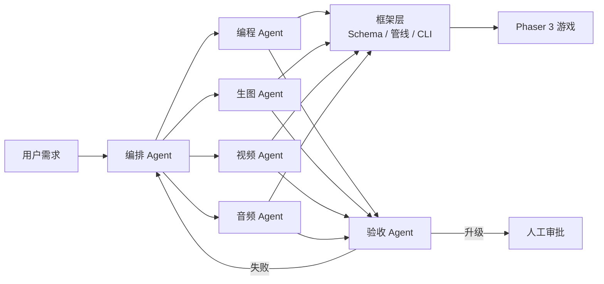

<div align="center">


# AIGF — AI Game Framework

**开源的多 Agent 驱动 2D 游戏开发框架 · Phaser 3 + TypeScript + Vite**

> 用自然语言描述需求，`aigf run` 自动完成 **规划 → 生图 → 视频/音频 → 编程 → 验收回炉** 全流程。  
> 强约束 TaskSpec 路径沙箱 · manifest id 契约 · 多人协作审批 · GDD 文档与 Git 钩子 · MIT 开源

不自研渲染引擎，专注 **AI 编排、资产管线与质量闭环**，支持 OpenAI / Runway / Kling / Replicate 等 API 自配。

[](./package.json)
[](./LICENSE)
[](https://nodejs.org/)
[](https://www.typescriptlang.org/)
[](https://phaser.io/)
[](https://gitee.com/abdul-rehma/game)
[](https://github.com/abb-sss/game)
[](./.github/workflows/ci.yml)

[快速开始](#-快速开始) ·
[CLI 命令](#-cli-命令一览) ·
[架构说明](./docs/architecture.md) ·
[Agent 编制](./docs/agent-roster.md) ·
[Gitee 调研](./docs/gitee-landscape.md) ·
[GitHub 调研](./docs/github-landscape.md) ·
[AGENTS.md](./AGENTS.md) ·
[贡献指南](./CONTRIBUTING.md)

</div>

---

## 📖 目录

- [✨ 特性](#-特性)
- [🏗️ 架构](#️-架构)
- [🚀 快速开始](#-快速开始)
- [📁 项目结构](#-项目结构)
- [🧩 核心概念](#-核心概念)
- [⌨️ CLI 命令一览](#️-cli-命令一览)
- [🤖 接入 AI 模型](#-接入-ai-模型)
- [🗺️ 开发路线](#️-开发路线)
- [🤝 参与贡献](#-参与贡献)
- [📄 许可证](#-许可证)

---

## ✨ 特性

| | 能力 | 说明 |
|:---:|:---|:---|
| 🤖 | **多 Agent 分工** | 编程 / 生图 / 视频 / 音频 各司其职，编排 Agent 统一派单 |
| 🔒 | **强约束体系** | TaskSpec 路径沙箱、manifest id 契约、Zod Schema 校验 |
| 🔄 | **验收第一时间回炉** | Review 失败 → 自动路由责任 Agent 重造 |
| 🎮 | **2D 开箱即用** | Phaser 3 模板 + `game.spec.yaml` + `style_bible.yaml` |
| 🎬 | **资产管线** | 生图 → 视频 API → ffmpeg 抽帧 → 精灵表 → 代码注册 |
| 👥 | **多人协作审批** | 认领 / 审计日志 / 看板实时 SSE |
| 📋 | **GDD + Git 钩子** | 设计文档模板、`aigf hooks install` 提交前验证 |
| 🎮 | **E2E 玩测** | `aigf playtest` 按 `game.spec.yaml` 验收技能与资产，输出报告 |
| 🚀 | **一键部署** | `aigf deploy gh-pages` 构建并输出静态站 |
| 🖥️ | **看板 Live Preview** | Dashboard 内嵌游戏预览（构建 + vite preview） |
| 🔍 | **Phaser API lint** | `aigf validate` 检测废弃 API 用法 |
| 📘 | **AI 协作规范** | 根目录 `AGENTS.md` + `design/STATE.md` 多会话续作 |
| 🌐 | **开源友好** | MIT 许可，模型 API 自配，支持 OpenAI 兼容接口 |

---

## 🏗️ 架构



**技能生成典型 DAG（4 步）：**

```
生图 icon_*  →  音频 sfx_*  ─┐
                视频 anim_*  ─┼→  编程 code_*
```

---

## 🚀 快速开始

### 环境要求

- **Node.js** >= 20
- **npm**（随 Node 安装）
- 可选：[ffmpeg](https://ffmpeg.org/)（提升视频抽帧质量）

### 1️⃣ 克隆与构建

```bash
# Gitee（国内推荐）
git clone https://gitee.com/abdul-rehma/game.git

# GitHub
git clone https://github.com/abb-sss/game.git

cd game
npm install
npm run build
```

### 2️⃣ 验证与演示

```bash
# 生成占位资产
npm run setup:demo

# 校验项目完整性
npm run validate

# E2E 验收（自动安装 Chromium，按 game.spec 测技能/资产）
npm run playtest

# dry-run：无需 API Key，跑通 4 步 Agent 工作流
npm run run:demo:full

# 启动可玩 demo（浏览器按 SPACE 释放火球术）
npm run dev:demo
```

### 3️⃣ 任务看板

```bash
npm run dashboard
# 浏览器打开 http://localhost:3847
```

### 4️⃣ 创建你自己的游戏

```bash
node packages/cli/dist/index.js init ./my-game
cd my-game && npm install
node scripts/generate-placeholders.mjs
```

### 5️⃣ 配置 AI（可选）

复制 `.env.example` 为 `.env`，填入 API Key 后：

```bash
aigf run "添加雷电术" --project ./templates/phaser-2d
```

---

## 📁 项目结构

```
aigf/
├── packages/
│   ├── core/           # 类型、Schema、状态机、路径沙箱
│   ├── llm/            # OpenAI 兼容 LLM 客户端
│   ├── providers/      # DALL·E / TTS / Runway / Kling / Replicate
│   ├── pipeline/       # 精灵表、resize、ffmpeg 抽帧
│   ├── orchestrator/   # 编排、回炉路由、人工审批
│   ├── review/         # 验收 Agent
│   ├── cli/            # aigf 命令行
│   └── dashboard/      # 任务看板 Web UI（SSE）
├── agents/
│   ├── code/           # 编程 Agent
│   ├── image/          # 生图 Agent
│   ├── video/          # 视频 Agent
│   └── audio/          # 音频 Agent
├── templates/
│   ├── phaser-2d/      # Phaser 2D 可玩模板（含 e2e/ 玩测）
│   └── docs/           # GDD / ADR / STATE 模板
├── docs/               # 架构、Agent、Gitee/GitHub 调研
├── AGENTS.md           # AI Agent 协作宪法
├── schemas/            # JSON Schema
├── prompts/            # Agent 系统提示词
└── examples/           # 基础流程示例
```

---

## 🧩 核心概念

### 📄 GameSpec（`game.spec.yaml`）

机器可读的游戏规格——实体、技能、胜负条件的**单一真相源**。

### 🎨 Style Bible（`style_bible.yaml`）

多模态 Agent 共享的风格约束，生图 / 视频 / 音频派单时必附。

### 📦 Asset Manifest（`assets/manifest.json`）

资产逻辑 id 注册表。**manifest id 由编排 Agent 预分配**，Phaser 纹理 key 必须等于 manifest id。

### 📋 TaskSpec

编排 Agent 派发给专家 Agent 的结构化任务单：

| 字段 | 说明 |
|------|------|
| `allowedPaths` | 允许修改的文件路径（支持 glob） |
| `forbiddenPaths` | 禁止修改的路径 |
| `context.manifestIds` | 本任务涉及的 manifest id |
| `context.instruction` | 任务指令 |
| `reworkContext` | 回炉失败上下文与 retry_hint |

### ✅ ReviewReport

验收 Agent 输出。`passed: false` 时含 `failures[].responsibleAgent` 与 `retryHint`，编排层**立即**创建回炉任务。

---

## ⌨️ CLI 命令一览

| 命令 | 说明 |
|------|------|
| `aigf init <目录>` | 从 Phaser 模板创建新项目 |
| `aigf run "<需求>"` | LLM 规划 + 派单 + 验收回炉 |
| `aigf run ... --dry-run` | 占位模式，无需 API Key |
| `aigf validate` | 校验 Schema、资产、命名契约 |
| `aigf validate --strict` | 警告（如缺 GDD）也视为失败 |
| `aigf status` | 任务状态 / 待审批 / 事件摘要 |
| `aigf approve [task-id]` | 人工审批（retry / skip / abort） |
| `aigf approve <id> --claim --reviewer 名` | 多人协作认领 |
| `aigf dashboard` | 启动 SSE 任务看板 |
| `aigf doc init` | 生成 `design/GDD.md`、`STATE.md` 等 |
| `aigf playtest` | E2E 验收（game.spec 驱动 → `.aigf/playtest-report.json`） |
| `aigf deploy gh-pages` | 构建游戏并输出 `dist/gh-pages` |
| `aigf deploy static` | 仅构建游戏 `dist/` |
| `aigf hooks install` | Git pre-commit 自动 validate |

```bash
# 常用示例
aigf run "添加冰锥术" --project ./templates/phaser-2d --dry-run
aigf approve --project ./templates/phaser-2d
aigf status --project ./templates/phaser-2d
```

环境变量详见 [`.env.example`](./.env.example) 与 [Agent 接入指南](./docs/agents.md)。

---

## 🤖 接入 AI 模型

| Agent | 环境变量 | 建议模型 |
|-------|----------|----------|
| 编排 / 编程 | `AIGF_LLM_API_KEY` | GPT-4o / DeepSeek / Ollama 等 |
| 生图 | `AIGF_IMAGE_API_KEY` | DALL·E 3 / Flux / SDXL |
| 音频 | `AIGF_AUDIO_API_KEY` | OpenAI TTS |
| 视频 | `AIGF_VIDEO_PROVIDER` | `replicate` / `runway` / `kling` / `local` |

接入步骤：

1. 在 `AgentAdapter.dispatch()` 中调用模型 API
2. 使用 `prompts/` 系统提示词
3. 写入前调用 `assertPathAllowed()` 校验路径
4. 提交后由 `@aigf/review` 验收，失败自动回炉

---

## 🗺️ 开发路线

| 版本 | 状态 | 内容 |
|------|:----:|------|
| v0.1 | ✅ | 核心框架、状态机、回炉路由、Phaser 模板 |
| v0.2 | ✅ | LLM 客户端、pipeline、CLI init/run |
| v0.3 | ✅ | 生图/音频 API、智能规划、任务看板 |
| v0.4 | ✅ | 视频 Agent、32×32 缩放、SSE 看板 |
| v0.5 | ✅ | Replicate 视频、人工审批、Code 模板生成 |
| v0.6 | ✅ | Runway / Kling 直连 API |
| v0.7 | ✅ | 多人协作审批、审计、`aigf status` |
| v0.8 | ✅ | GDD 模板、增强 validate、Git 钩子 |
| v0.9 | ✅ | GitHub 竞品调研、AGENTS.md、Playwright 玩测、STATE.md |
| v0.10 | ✅ | `aigf deploy`、看板 Live Preview、Phaser API lint |

---

## 🤝 参与贡献

欢迎提交 Agent 适配器、游戏模板、验收规则和文档改进。

1. Fork [Gitee](https://gitee.com/abdul-rehma/game) 或 [GitHub](https://github.com/abb-sss/game) 仓库
2. 创建特性分支 `git checkout -b feat/xxx`
3. 提交前运行 `npm run build && npm test && npm run validate`
4. 发起 Pull Request

详见 [CONTRIBUTING.md](./CONTRIBUTING.md)。

---

## 📄 许可证

[MIT License](./LICENSE) — 可自由用于商业与开源项目。

---

<div align="center">

**作者 / Maintainer：** [阿卜杜热合曼的](https://gitee.com/abdul-rehma) · [@abb-sss](https://github.com/abb-sss)

**如果这个项目对你有帮助，欢迎 ⭐ Star 支持一下！**

[⬆ 回到顶部](#aigf--ai-game-framework)

</div>
